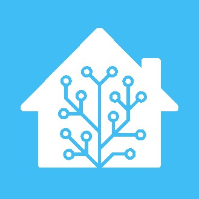
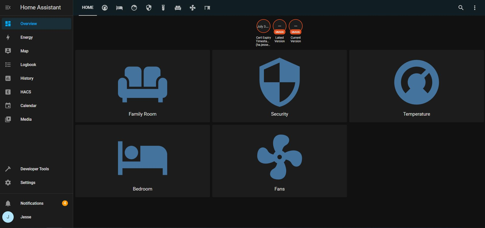
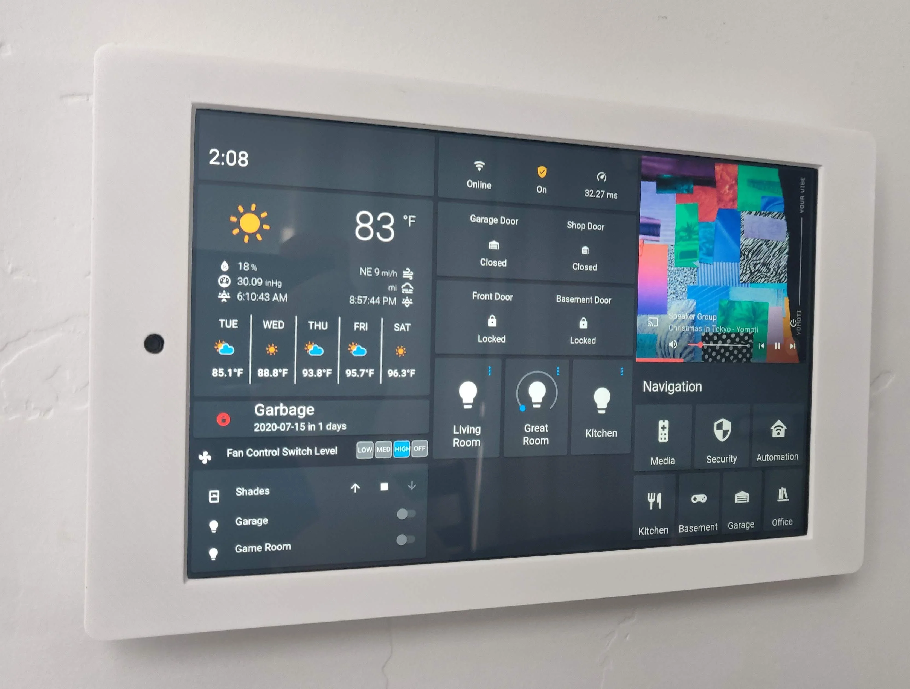
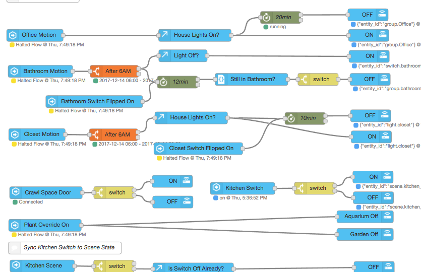
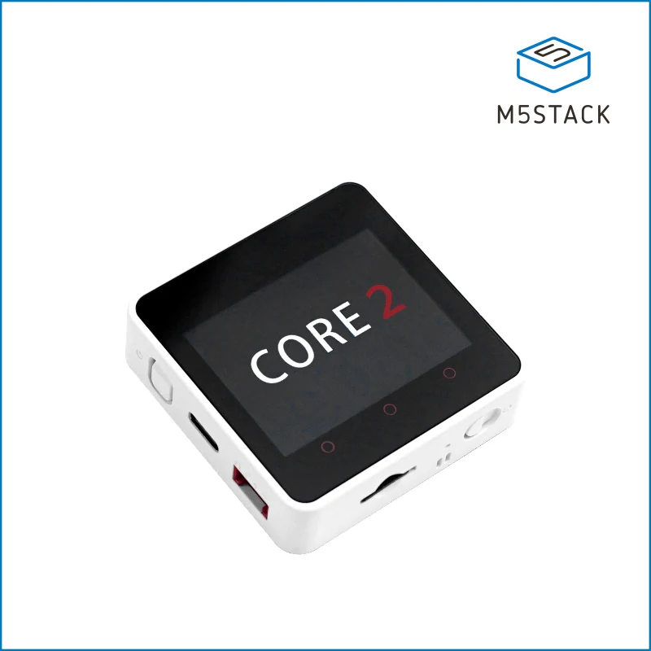
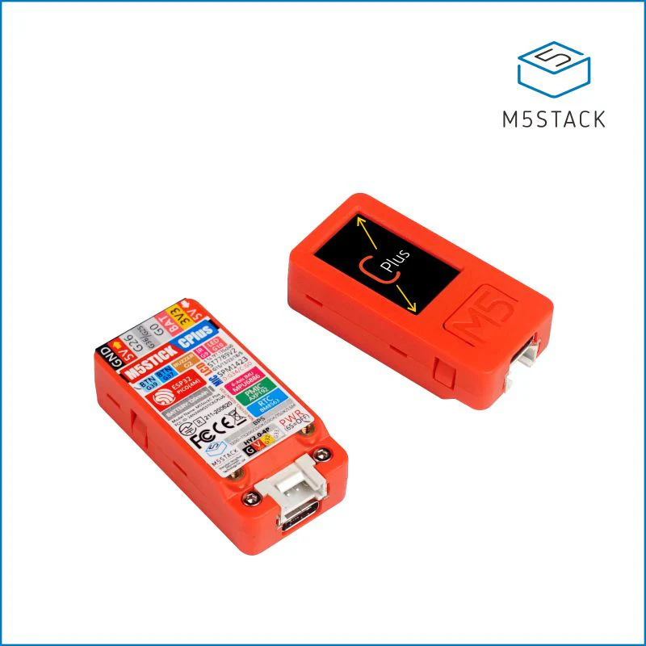
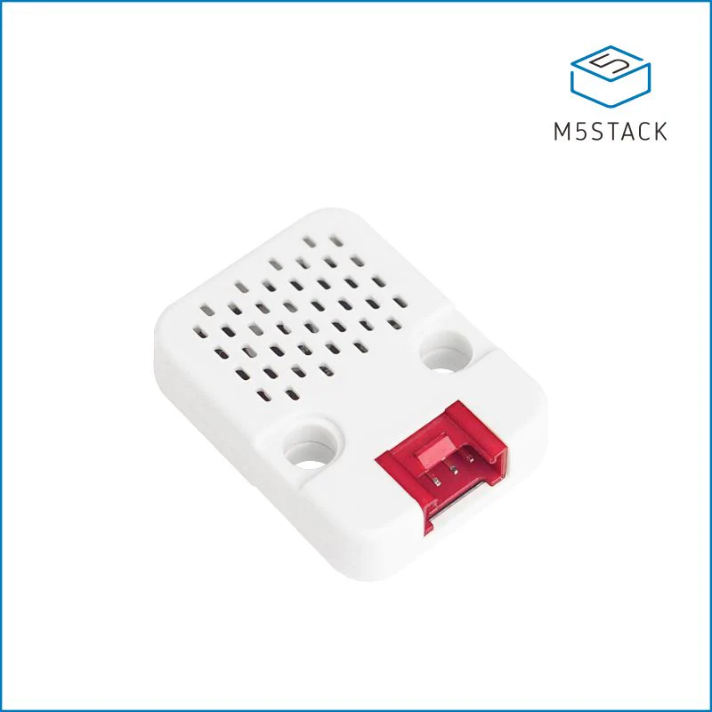
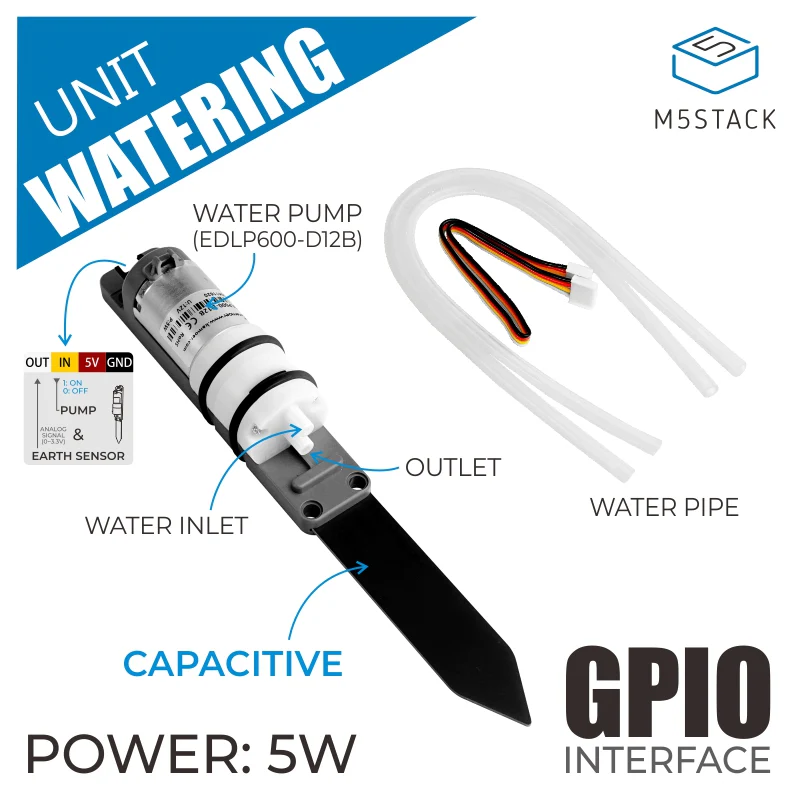

## Home Assistant
##### With some IoT

---

### Jesse Schein
Tech Lead
PwC
.Net/Angular/Azure/Dev Ops
- LinkedIn: [jesse-schein](https://www.linkedin.com/in/jesseschein/)
- GitHub: [jesse-schein](https://github.com/jesse-schein)

---
# Agenda
- Skills & Knowledge Required
- Home Assistant
- IoT & ESP32

---

# Home Assistant

[https://www.home-assistant.io](https://www.home-assistant.io) 
ㅤ

[https://www.nabucasa.com/](https://www.nabucasa.com/)

---
## Skills & Knowledge Required
No Code OR

- Python
- Docker
- Server Management
- C++
- YAML
- GIT
- Networking

---

### The Basics

- Integrations
- Devices/Entities
- Automations
- Google, Alexa, & Homekit
- Dashboards
--- 

### Home Assistant Dashboard

---
### Wall Dashboard

---
### Home Assistant - Integrations
- Over 1936 official integrations and many more on GitHub
- Popular ones include: Ikea, Google, Ecobee, Plex, MQTT, Alexa, Zigbee & Z-Wave
- Can create your own
- Can easily create custom devices to do whatever using ESPHome and ESP8266/ESP32 
(found in many cheap smart devices)

---
### Install Methods

- Home Assistant Operating System
- Run in a docker container
- Run manually in python (don't do this)
- Raspberry Pi 3B+/4
- Any cheap PC/Server
- Virtual

---
### Integrations & Devices

- You setup Integrations
- Integrations give you devices and entities
- A device represents a "thing" 
- An entity represents a feature of a "thing"

---

### Jesse's Recommended Devices

<table>
<tr>
    <th>Type of Device</th>
    <th>Brand(s)</th>
</tr>

<tr>
    <td>Thermostat</td>
    <td>Ecobee / ZWave (honeywell)</td>
<tr>

<tr>
    <td>Alarm System</td>
    <td>Ring</td>
</tr>

<tr>
    <td>Motion Sensors</td>
    <td>Aqara Zigbee / Zooz ZWave </td>
</tr>

<tr>
    <td>Lights/Switches</td>
    <td>Zooz Switches / Zigbee Bulbs</td>
</tr>

<tr>
    <td>Zigbee / ZWave Dongles</td>
    <td>Nortek GoControl or Aeotec & Conbee</td>
</tr>

<tr>
    <td>Custom Devices</td>
    <td>M5Stack Boards</td>
</tr>

<tr>
    <td>Smart Speaker</td>
    <td>Google or Alexa</td>
</tr>

<tr>
    <td>Smart Door Lock</td>
    <td>Yale with ZWave or August Module</td>
</tr>

</table>

--- 

### Automations
- Done in Home Assistant directly
- Done via Node-Red

---

### Node Red

---

### ESP32 Microcontroller

- Manufactured at scale in China by Espressif
- Low Powered programmable 
- Used in many consumer products
- Over-The-Air updates
- No code required
    - YAML to C++
    - Flash with Tasmota (web ui)

---
### ESP32 Specs

- Single or Dual core up to 240mhz
- 385 KB - 512 KB ram
- External ram support
- 4 MB - 16 MB flash storage
- WiFi or Wifi/BLE/Bluetooth or Zigbee
- 40+ General Purpose Pins

---
### M5Stack Pre-Made Boards

- https://shop.m5stack.com/collections/m5-controllers

---

### ESPHome by Home Assistant

- No code based way to program custom devices
- YAML based
- Code Sharing
- Many examples online
- Can pretty much use any sensor

---

### Demo Time